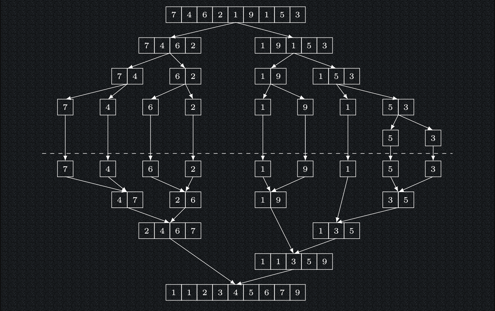

- Jedná se o rychlý rekurzivní algoritmus pro řazení, založený na
  **slévání seřazených podposloupností**.
- Posloupnost o jednom prvku je už seřazená.
- Mějme vstupní neseřazenou posloupnost $n$ prvků pro $n$ $\geq 2$.
- Rozdělíme ji na dvě části poloviční délky (řekněme prvních
  $⌊n/2⌋$ a zbývajících $⌈n/2⌉$ prvků).
- Rekurzivním voláním téhož algoritmu na obě poloviny je
  seřadíme.
- Obě seřazené poloviny posléze **slijeme** dohromady do jedné
  seřazené posloupnosti a máme výsledek.

---

**Vstup**: posloupnost $n$ čísel <br>
**Výstup**: vzestupně seřazená posloupnost ze vstupu

---
<a id="algo-8.1"></a>
!!! Algorithm "Algoritmus 8.1 (Mergesort)"

    ```math title="MergeSort(a1, . . . , an):"
    Pokud n = 1: vrať jako výsledek b1 = a1 a skonči
    x1,..., x⌊n/2⌋:= MergeSort(a1,..., a⌊n/2⌋)
    y1, ..., y⌈n/2⌉:= MergeSort(a⌊n/2⌋+1,..., an)
    Vrať b1,..., bn := Merge(x1,..., x⌊n/2⌋; y1,..., y⌈n/2⌉)
    ```

- Procedura Merge má na vstupu dvě vzestupně seřazené
  posloupnosti (jednorozměrná pole) a provádí jejich slévání do
  jediné seřazené posloupnosti.
- Dostaneme tak datově necitlivý, out-of-place a stabilní
  řadící algoritmus.

---

**Vstup**: dvě vzestupně seřazené posloupnosti<br>
**Výstup**: vzestupně seřazená posloupnost vzniklá slitím vstupů

---

<a id="algo-8.2"></a>
!!! Algorithm "Algoritmus 8.2 (Merge)"

    ```math title="Merge(x1, . . . , xm; y1, . . . , yn):"
    i := 1, j := 1, k := 1
    Dokud i ≤ m a j ≤ n, opakujeme:
        Pokud xi ≤ yj :                             //přesuneme prvek z x
            zk := xi, i := i + 1 
        Jinak:                                      //přesuneme prvek z y
            zk := yj , j := j + 1
        k := k + 1
    Pokud i ≤ m:                                     //přesuneme zbytek x
        zk,...,zm+n := xi,...,xm
    Pokud j ≤ n:                                    //přesuneme zbytek y
        zk,...,zm+n := yj,...,yn
    Vrať z1,...,zm+n
    ```

---

## Příklad řazení pomocí algoritmu Mergesort

---

{ align=center }

---

## Časová složitost algoritmu MergeSort

---

!!! Implication "Pozorování"

    - Operace **Merge** pouze přesouvá prvky a každý prvek přesune právě jednou.
    - Její časová složitost je tedy $Θ(n + m)$, kde $n$, $m$ jsou délky slévaných polí.
    - Vyžaduje pomocnou paměť ve formě pomocného pole velikosti $Θ(n + m)$.

<a id="theorem-8.1"></a>
!!! Theorem "Věta 8.1"

    ### Časová složitost MergeSort {#theorem-8.1}
    Časová složitost **MergeSort** je $Θ(n\ log n)$.

??? Proof "Důkaz Věty 8.1"

    - Rozdělení posloupnosti a slití seřazených kusů trvá čas $cn$.
    - Algoritmus volá $2×$ sebe sama na vstupy velikosti $n/2$. Proto<br>
                $T (1) = 1$,<br>
                $T (n) = 2·T (n/2) + cn$.
    - Po rozvinutí dostaneme:<br>
                $T (n) = 2·(2·T (n/4) + cn/2) + cn =$<br>
                $= 4·T (n/4) + 2cn =$<br>
                $= 8·T (n/8) + 3cn =$<br>
                $···$<br>
                $= 2^k·T (n/2^k) + kcn.$
    - Rekurze skončí, když $n/2^k = 1$ čili $k = log\ n$. Tím dostaneme
    $T (n) = 2^{log\ n}·T (1) + log\ n·cn = Θ(n) + cn\ log\ n = Θ(n\ log\ n)$.

<a id="theorem-8.2"></a>
!!! Theorem "Věta 8.2"

    ### Paměťová složitost MergeSort {#theorem-8.2}
    Paměťová složitost **MergeSort** je $Θ(n)$.

??? Proof "Důkaz Věty 8.2"

    - MergeSort si pamatuje lokální proměnné: vstup a jejich
    setříděné poloviny, dohromady $Θ(n)$ paměti. Plus kontext pro
    návrat z rekurzivního zanoření ($O(1)$ paměti).
    - Mimo to obě rekurzivní volání spotřebují další paměť, ale jelikož
    vždy běží pouze jedno z nich, stačí započítat pouze jedno.
    - Dostaneme tuto rekurentní rovnici (pro kladnou konstantu $d$):<br>
                $M (1) = 1$,<br>
                $M (n) = dn + M (n/2)$
    - To nám pro $M (n)$ dává geometrickou řadu
    $dn + dn/2 + dn/4 +···$, která má součet $Θ(n)$.
