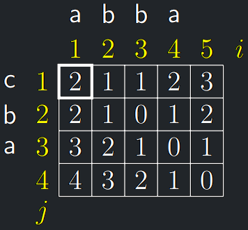

<a id="def-10.0"></a>
!!! Definition "Definice 10.0 (Levenshteinova vzdálenost)"

    - Uvažujme řetězce nad abecedou $\Sigma$.
    - **Editační operací** na řetězci nazveme vložení znaku, smazání znaku
    nebo záměnu jednoho znaku jiným.
    - **Editační vzdálenost řetězců** (EVŘ) $x = x_1,\dots,x_m$ a
    $y = y_1,\dots,y_n$, značíme $L(x, y)$, <br> je **nejmenší** počet editačních
    operací potřebných k tomu, abychom z řetězce $x$ vytvořili řetězec $y$.

Např. pro $\Sigma = {a,b,c}$ je $L(abba, cba) = 2$, jelikož:

{style=display:block;margin-left:auto;margin-right:auto;height:60px}

## EVŘ - idea rekurzivního řešení

- V **nejkratší** posloupnosti editačních operací se **každého znaku
  týká nejvýše jedna editační operace**, takže editační operace
  lze vždy uspořádat **zleva doprava**.
- Můžeme si tedy představit, že procházíme $x = x_1,\dots,x_m$ zleva
  doprava a postupně ho přetváříme na $y = y_1,\dots,y_n$ a hledáme
  nejmenší počet editačních operací, kterými to dokážeme.
    - Pokud $x_1 = y_1$, můžeme první znak ponechat beze změny a
      **rekurzivně** pak tudíž platí $L(x,y) = L(x_2 \dots x_m, y_2 \dots y_n)$.
    - Jinak máme 3 možnosti, z nichž volíme tu, která dá nejmenší řešení:
        1. Znak $x_1$ zaměníme za $y_1$. <br>
           Pak $L(x,y) = 1 + L(x_2 \dots x_m, y_2 \dots y_n)$.
        2. Znak $x_1$ smažeme. <br>
           Pak $L(x,y) = 1 + L(x_2 \dots x_m, y_1 \dots y_n)$.
        3. Před řetězec $x$ vložíme znak $y_1$. <br>
           Pak $L(x,y) = 1 + L(x_1 \dots x_m, y_2 \dots y_n)$.
- Editační vzdálenost 2 řetězců lze tedy vypočítat rekurzivně z
  editačních vzdáleností jejich podřetězců, přesněji jejich suffixů.
- Pokud $x_1 = y_1$

$$
L(x_1 \dots x_m, y_1 \dots y_n) = L(x_2 \dots x_m, y_2 \dots y_n)
$$

- Pokud $x_1 \ne y_1$

$$
L(x_1, \dots, x_m, y_1, \dots, y_n) = 1 + \min
\begin{cases}
L(x_2, \dots, x_m, y_2, \dots, y_n), \\
L(x_2, \dots, x_m, y_1, \dots, y_n), \\
L(x_1, \dots, x_m, y_2, \dots, y_n)
\end{cases}.
$$

- Rekurzivní volání budou mít na vstupu **suffixové** řetězce
  $x_i,\dots,x_m$ a $y_j,\dots,y_n$ pro $i = 1,\dots, m + 1$ a
  $j = 1,\dots, n + 1$.

<a id="algo-10.8"></a>
!!! Algorithm "Algoritmus 10.8 (EvrRec)"

    ```python
    EvrRec(i, j)                        // i, j=indexy začátků suffixů x, y
        Pokud i > m: Vrať n − j + 1     // vložení zbytku y za x
        Pokud j > n: Vrať m − i + 1     // smazání zbytku x
        ℓ_z := EvrRec(i + 1, j + 1)     // řešení pokud by x_i = y_j
        Pokud x_i = ̸= y_j:              // test nutnosti korekce
            ℓ_z := ℓ_z + 1              // korekce záměnou y_j za x_i
        ℓ_s := 1 + EvrRec(i + 1, j)     // smazání x_i
        ℓ_v := 1 + EvrRec(i, j + 1)     // vložení y_j před x_i
        Vrať min(ℓ_z, ℓ_s, ℓ_v)
    ```

- $L(x, y)$ se rovná hodnotě, kterou vrátí volání `EvrRec(1, 1)`.

!!! Theorem "Lemma časové složitosti EvrRec"

    Časová složitost `EvrRec` pro řetězce délky $m$ a $n$ je <br>
    $T(m, n) = \Omega(3^{min(m,n)})$ a $T(m, n) = O(3^{m+n−1})$.

??? Proof "Důkaz časové složitosti EvrRec"

    - Rekurze se v listech SRV zastaví, je-li jeden ze suffixů prázdný.
    - Struktura SRV tedy závisí na $m$ a $n$. Nechť BÚNO $m \ge n$.
    - SRV je **ternární**: algoritmus zkoumá rekurzivně záměnu,
    smazání a vložení pro každou dvojici neprázdných suffixů.
    - **Nejmenší** možná hloubka zanoření rekurze je $n$, např. když
    kratší řetězec je **prefixem** delšího: $x = y_1 \dots y_n x_{n+1} \dots x_m$.
    - Naopak **největší** možná hloubka zanoření rekurze je $m + n − 1$,
    kdy délky řetězců se **zkracují střídavě** tak, abychom se dostali
    na oba suffixy délky jedna.
    - V každém uzlu SRV provede $O(1)$ operací.

---

## EVŘ - memoizace

- Hodnotu, kterou vrátí první zavolání `EvrMem(i, j)`, ukládáme do
  políčka $M[i, j], i = 1,\dots, m + 1, j = 1, . . . , n + 1$.
- Na konci má být $M[i, j] = L(x_i \dots  x_m, y_j \dots y_n)$, kde
    - $x_i \dots x_m = \epsilon$, pokud $i = m + 1$ a
    - $y_j \dots y_n = \epsilon$, pokud $j = n + 1$.
- Řešení je na konci v $M[1, 1]$.

{style=display:block;margin-left:auto;margin-right:auto;}

<a id="algo-10.9"></a>
!!! Algorithm "Algoritmus 10.9 (EvrMem)"

    ```python
     EvrMem(i, j)                           // i, j=indexy začátků suffixů x, y
        Pokud je M[i, j] definováno: Vrať M[i, j]
        Pokud i > m: M[i, j] := n − j + 1; Vrať M[i, j];
        Pokud j > n: M[i, j] := m − i + 1; Vrať M[i, j];
        ℓ_z := EvrMem(i + 1, j + 1)         // řešení pokud by x_i = y_j
        Pokud x_i = ̸= y_j:                  // test nutnosti korekce
            ℓ_z := ℓ_z + 1                  // korekce záměnou y_j za x_i
        ℓ_s := 1 + EvrMem(i + 1, j)         // smazání x_i
        ℓ_v := 1 + EvrMem(i, j + 1)         //vložení y_j před x_i
        M[i, j] := min(ℓ_z, ℓ_s, ℓ_v)
        Vrať M[i, j]
    ```

!!! Implication "Pozorování"

    Časová i paměťová složitost `EvrMem(1, 1)` je $O(mn)$.

---

## EVŘ - iterativní řešení

- Iterativní řešení, kdy počítáme položky tabulky $T$ z pravého
  dolního rohu směrem k levému hornímu rohu, kdy řešení pro dva
  řetězce vybereme jako minimum z již známých řešení pro výše
  popsané tři kombinace jejich suffixů, je ponechána na cvičení

!!! Implication "Iterativní předpis řešení EVŘ"

    - Mějme slova $A$ a $B$ a tabulku $M[n, m]$, kde $n = |A|$ a $m = |B|$
    - Poté pro krok iterace platí 

    $$
       M[i,j] = 
            \begin{cases}
            M[i+1,j+1]&{if A[i] = B[j]} \\
            1 + \min{M[i+1, j], M[i, j+1], M[i+1, j+1]}
            \end{cases}
    $$

    - Každé $M[i,j]$ závisí pouze na větších $i$,$j$ jedná se tedy o DAG
    - Iterovat budeme postupně po řádcích resp. sloupcích od pravého dolního rohu
    - Základní krok

    $$
        (\forall i \in \hat{n})(M[i,m] = i), (\forall j \in \hat{m})(M[n,j] = j)
    $$

    - Výsledek bude $M[0,0]$
