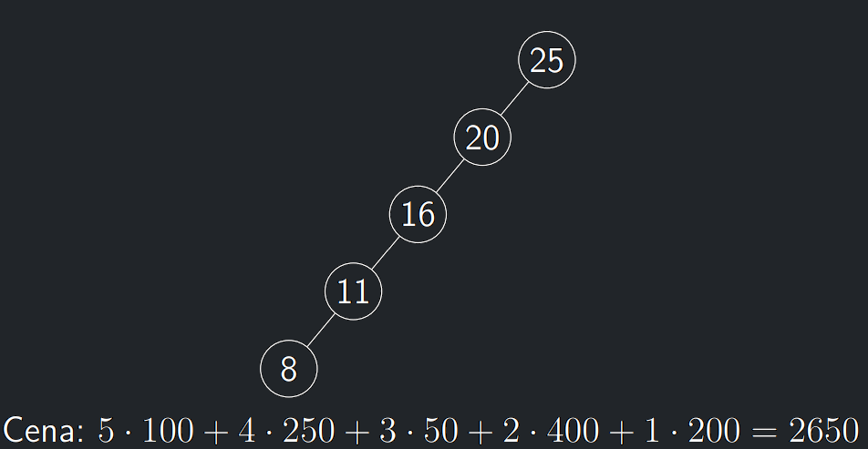
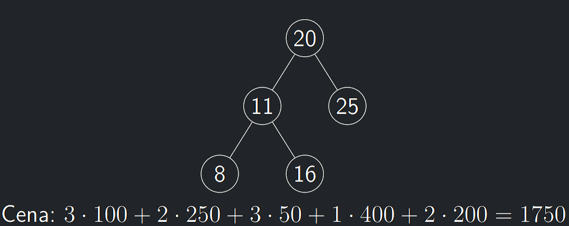

- Pro danou množinu hodnot není BVS jednoznačně určený.
- Ne vždy je nejdůležitějším faktorem hloubka celého stromu.
- Občas je důležitá hloubka daného prvku/klíče a frekvence jeho vyhledávání.
- Mějme data obsahující prvky 8, 11, 16, 20, 25.
- Nechť je vypozorováno v posledních tisíci vyhledáváních, že
  prvek 8 je vyhledáván 100krát, prvek 11 je vyhledáván 250krát a
  další prvky po řadě 50, 400 a 200krát.

{style=display:block;margin-left:auto;margin-right:auto;max-width:500px}
{style=display:block;margin-left:auto;margin-right:auto;max-width:500px}

---

## Histogramové BVS - myšlenka

- Hledané BVS musí mít nějaký kořen.
- Jelikož kořen neznáme a protože není vůbec jasné jak poznat
  správný kořen, rezignujeme a „prostě vyzkoušíme všechny“.
- Jestliže jsme jako kořen zvolili hodnotu r, rozdělí se naše data na <br>
  dvě části $L = \{1, \dots , r − 1\}$ a $R = \{r + 1, \dots , n\}$.
- Naším dalším úkolem pak bude naleznout nejlepší možné stromy
  $T_L$ a $T_R$ pro tato data a získat výsledek.
- Data obsažená v $L$ i v $R$ získají jedno vyhledávání navíc.

$$
1 \cdot p_r + \sum_{i \in L}(1 + h_L(i))p_i + \sum_{i \in R}(1 + h_R(i))p_i
= \sum_{i \in [n]} p_i + \sum_{i \in L} h_L(i)p_i + \sum_{i \in R} h_R(i)p_i
$$

- kde $h_L(i)$ a $h_R(i)$ označují příslušné hladiny ve stromech pro data v $L$ a $R$.

<a id="algo-10.10"></a>
!!! Algorithm "Algoritmus 10.10 (BVSOPT_rec)"

    ```python
    BVSOPT_rec(p_1,...,p_n)
        Pokud n = 0: Vrať 0
        x := Sum(i∈[n], p_i)
        m := +∞
        Pro r = 1,...,n:
            L := {p_1,..., p_{r−1}}, R := {p_{r+1},..., p_n}
            c_L := BVSOPT_rec(L)
            c_R := BVSOPT_rec(R)
            m := min(m, c_L + c_R)
        Vrať m + x
    ``` 

!!! Implication "Pozorování o BVSOPT_rec"

    `BVSOPT_rec(p_1,...,p_n)` je konečný a vrací hodnotu nějakého BVS.

!!! Theorem "Lemma o korektnosi BVSOPT_rec"

    `BVSOPT_rec(p_1,...,p_n)` vrací hodnotu optimálního řešení.

??? Proof "Důkaz korektnosti BVSOPT_rec"

    - `BVSOPT_rec(p_1,...,p_n)` vrací hodnotu pro nějaký BVS a tedy
    speciálně vrací horní odhad na optimum.
    - Obráceně pak uvažme nějaké optimální řešení – tedy binární
    vyhledávací strom $T$.
    - Formálně dokazujeme indukcí podle velikosti (tj. počtu vrcholů)
    stromu $T$.

    **ZI:** Pro jdenovrcholové stromy jistě vrací optmální řešení.

    **IK:** 

    - Nechť tedy $T$ má alespoň 2 vrcholy a nechť $r$ je jeho kořen
    (`BVSOPT_rec` zkouší $r$).
    - Dále se strom $T$ skládá z levého podstromu $T_L$, který obsahuje
    data $L$ (obdobně pro $R$).
    - Protože $T_L$ má alespoň o jeden vrchol méně než $T$, lze na něho
    aplikovat indukční předpoklad, tedy `BVSOPT_rec(L)` vrátí
    hodnotu optimálního řešení (nanejvýš takové ceny jako $T_L$).
    - Stejně pro $T_R$.
    - Pak ale cena vrácená `BVSOPT_rec` je nanejvýš taková jako je cena $T$.

---

## Histogramové BVS - memoizace

- Indexy $l, u \in n$ – odkud kam sahají aktivní data.
- Pomocné pole $M[n][n]$ incializované na $\bot$.

<a id="algo-10.11"></a>
!!! Algorithm "Algoritmus 10.11 (BVSOPT)"

    ```python
     BVSOPT(ℓ, u)
        Pokud (M[ℓ, u] ̸= ⊥): Vrať M[ℓ, u]
        Pokud (ℓ > u): Vrať M[ℓ][u] := 0
        x := Sum(i=ℓ to u, p_i)
        m := +∞
        Pro každé r ∈ {ℓ, . . . , u}:
            c_L := BVSOPT(ℓ, r − 1)
            c_R := BVSOPT(r + 1, u)
            m := min(m, c_L + c_R)
        Vrať M[ℓ][u] := m + x    
    ``` 

!!! Theorem "Lemma o časové složitosti BVSOPT"

    `BVSOPT(1, n)` počítá v čase $O(n^3)$.

!!! Implication "K zamyšlení"

    Časová složitos se dá vylepšit na $O(n^2)$ pomocí chytřejšího výběru kořenu (řádek 6)
