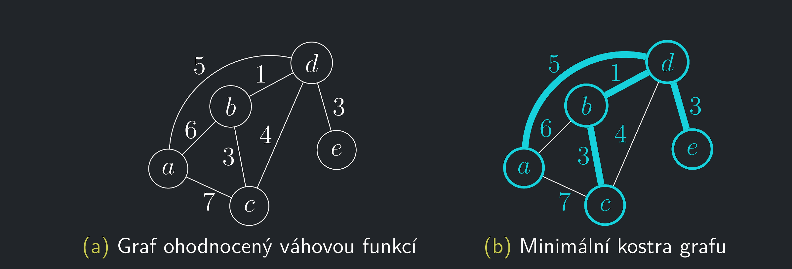

### Motivace

- Napadl sníh a všechny ulice města jsou zasněžené.
- Které ulice prohrneme, aby šlo dojet odkudkoliv kamkoliv, a přitom nám prohrnutí sněhu dalo co nejméně práce?

{ align=center }

- Tato otázka vede na hledání tzv. **minimální kostry grafu**.

- Popišme nyní problém formálně.
- Připomenutí: Kostra grafu $G$ je podgraf, který obsahuje všechny vrcholy a je to strom, a má tedy $|V (G)| − 1$ hran.

---

!!! Definition "Definice 11.1 (Minimální kostra grafu)"

    ### Minimální kostra grafu {#def-11.1}
    
    - Mějme souvislý neorientovaný graf $G = (V, E)$.  Každé hraně $e \in E$ přiřadíme číselnou **váhu** $w(e)$,
    kde $w: E \to \mathbf{R}$. Takový graf se nazývá **hranově ohodnocený**.
    - Váhovou funkci můžeme přirozeně rozšířit na podgrafy: **Váha** $w(H)$ podgrafu $H \subseteq G$ je součet vah jeho hran.
    - Kostra hranově ohodnoceného grafu G je **minimální**, pokud má mezi všemi jeho kostrami nejmenší váhu.

